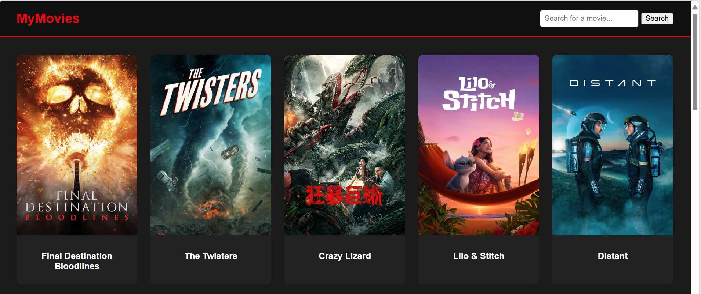

Movie Finder Website
    A simple and elegant web application for discovering movies. This project uses a Node.js backend to securely interact with The Movie Database (TMDB) API and a clean         frontend built with HTML, CSS, and vanilla JavaScript to display the data.

Features
    Displays Popular Movies: On page load, the site automatically fetches and displays the most popular movies.

Movie Search: Users can search for movies by title using the search bar in the header.

Responsive Design: The movie grid adjusts smoothly to different screen sizes.

Secure API Handling: 
    The backend server handles all communication with the TMDB API, keeping the private API key safe and off the client-side.

Tech Stack
Frontend:

    HTML5

    CSS3

    Vanilla JavaScript (ES6+)

Backend:

    Node.js

    Express.js

API:

    The Movie Database (TMDB) API

Dependencies:

    axios: To make HTTP requests from the backend.

    dotenv: To manage environment variables (like the API key).
